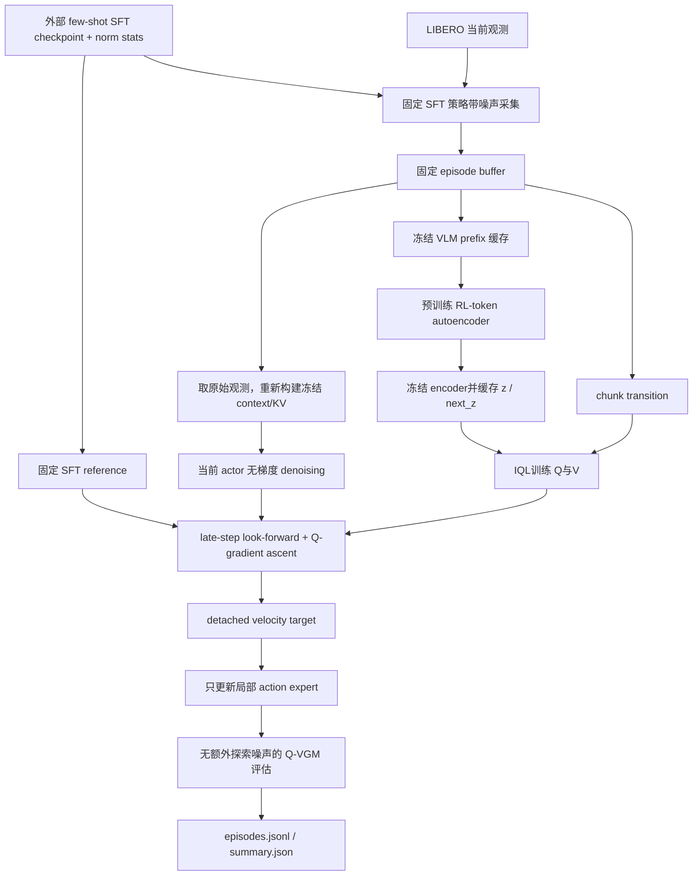
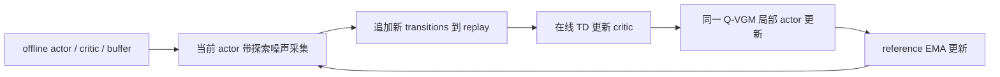

# Q-VGM 数据 pipeline

实现状态：**offline 已实现并完成训练，正式评估进行中；online 尚未实现**。实际进度、参数来源和使用命令见 [复现过程.md](复现过程.md)。本文中的 online 仅说明与 offline 的区别，不代表存在可执行入口。

## 1. Offline：当前代码实际做什么



采集时会与环境交互，但行为策略固定为初始 SFT。采集完成后，训练不再向 buffer 加新数据；因此该流程是 offline RL。末尾评估也与环境交互，但评估轨迹不回流训练。

### 1.1 外部资产 → 模型与环境

入口：`qvgm/config.py`、`qvgm/models/pi05_adapter.py`、`qvgm/envs/libero_env.py`。

| 输入 | 处理与去向 |
| --- | --- |
| `paths.checkpoint/model.safetensors` | 严格加载 π0.5；所有模型从同一 SFT 初始化 |
| `paths.norm_stats` | 输入 state 的 quantile normalization；输出动作的反归一化 |
| `paths.tokenizer` | 复制到本任务 OpenPI cache，供语言 tokenization 使用 |
| `paths.libero_root`、`paths.libero_assets` | BDDL、初始状态和仿真资产 |
| `paths.python` | 现有 OpenPI/LIBERO 环境的解释器 |

`setup_runtime` 在 `artifacts/runtime/` 生成独立 LIBERO 路径配置与 cache，不改动外部权重，也不使用 RLinf 的 Ray/worker/trainer。

### 1.2 观测 → context、prefix 与模型动作

| 数据 | 内容 / shape | 所在坐标系 |
| --- | --- | --- |
| `observation/image` | 第三视角，uint8 `[256,256,3]`，旋转 180° | 图像像素 |
| `observation/wrist_image` | 腕部相机，同上 | 图像像素 |
| `observation/state` | float32 `[8]`：EEF xyz、axis-angle xyz、gripper 两维 | 环境原始 state |
| `prompt` | 当前任务语言 | 字符串 |
| OpenPI 输入 | resize 至 224、归一化 state、tokenization、补齐维度；缺失第三路图像有 mask | 模型输入 |
| `context` | 冻结 VLM 的 state、prefix mask、KV cache、prefix hidden states | GPU 上的临时模型上下文 |
| 完整动作 `x_1` | normalized `[B,10,32]` | 模型坐标 |
| critic 动作 A | `x_1[:, :5, :7]` | normalized `[B,5,7]` |
| 环境动作 | 完整输出先反归一化，取前 5 步，每步 7 维 | LIBERO delta EEF / gripper 指令 |

prefix hidden dimension 为 2048。保存时去掉被 mask 的位置，转为 CPU bf16；有效长度 L 可随任务 prompt 改变。KV cache 不写入 buffer，actor 训练时从原始观测重新计算。

保持 checkpoint 的 `discrete_state_input=false`。虽然保存了 8 维 state，该配置不会把 proprio 编成离散 prefix token；不能把缓存 prefix 描述成显式含 proprio token 的表示。

### 1.3 探索采集 → episode 分片

入口：`scripts/collect_rollouts.py`。本次 10 个任务各 15 个 episode，150 episodes、4015 transitions，行为策略固定为 SFT。探索为 T=2、σ=0.08，K=10；不混入 expert demonstrations。

每次先提出 5 步动作，逐步执行；遇到成功、环境终止或 220 步上限即停止。保存新的边界观测，形成 chunk-aligned transition，而非每个物理 step 都生成一条 transition。

采集 seed：`7 + 100000 + task_id*10000 + episode`；初始状态使用 `initial_states[episode]`。reset 后先执行 10 步 settling dummy action，这些步不加入 replay。

输出：`artifacts/<run>/buffer/taskXX_episodeYYY.pt`。设一条 episode 有 N 个 chunk：

| 字段 | 类型 / shape | 含义 |
| --- | --- | --- |
| `schema` | int，当前 1 | 数据格式版本 |
| `task_id / episode / seed / success` | 标量 | 任务、初始状态索引、随机种子与整条 episode 是否成功 |
| `observations` | 长度 N+1 的 dict 列表 | 每个 chunk 起点与最后一个边界观测；字段为上一节的图像、state、prompt |
| `prefixes` | bf16 `[N+1,L,2048]` | 对应这些观测的冻结 VLM 有效 prefix |
| `transitions` | 长度 N 的 dict 列表 | 下表所列 chunk 数据 |

每个 `transitions[i]` 与 `observations[i] → observations[i+1]` 对齐：

| 字段 | 类型 / shape | 含义 |
| --- | --- | --- |
| `action` | float tensor `[5,7]` | 提出的 normalized chunk，非反归一化后的环境动作 |
| `rewards` | float tensor `[n]` | 实际执行各步的稀疏成功奖励 |
| `reward` | float | 已累计的折扣奖励 Σ γ^j r_j，训练时不再重复折扣 |
| `steps` | int，1≤n≤5 | 实际执行步数 |
| `terminated` | bool | 环境 done 或成功；IQL 禁止 bootstrap |
| `truncated` | bool | 达到本入口的时间上限但未真实终止；IQL 保留 bootstrap |

**提前终止时 `action` 仍保存完整提出的 `[5,7]`，末尾未执行部分不算真实动作执行记录；由 `steps` 标明实际 n。** 当前 critic 仍以完整提出的 chunk 为输入，奖励和折扣按实际 n 计算。当前分片不另存逐步反归一化动作或视频。

每个 episode 先写 `.tmp`，再原子替换为 `.pt`。重启采集跳过已存在分片；增加 episode 预算会补采缺失项。`buffer/config.json` 是采集时的配置快照，不一定等于后续训练的覆盖参数。

### 1.4 固定 buffer → RL-token 与特征缓存

入口：`scripts/train_rl_token.py`、`qvgm/data/replay_buffer.py`。

1. mmap 读取分片，枚举所有 N+1 个边界状态。
2. 按任务留出最后一部分完整 episode；本次每任务 15 个中最后 3 个留出，AE 用其余 12 个训练。
3. minibatch 中将变长 prefix 补零，附有效位置 mask；输入 F 始终 detach。
4. encoder 生成一个 token z，decoder 用右移的 prefix 做因果重建，更新 AE。
5. 预训练完成后冻结 encoder，为**所有 150 个 episode** 的边界状态缓存 z，包括留出 episode。

`validation_mse` 只检查 `valid[:micro_batch]`，本次是固定 8 个留出状态，不是整个留出集合的平均。

产物：

- `rl_token_<tag>.pt`：模型、optimizer、步数、随机状态、实际 settings/config 和 buffer signature。
- `features_<tag>.pt`：`z` 为逐 episode 列表，每项 float32 `[N+1,2048]`；另存 settings 和 buffer signature。

AE 的留出划分用于重建诊断；IQL/actor 使用全部固定 replay，并没有独立的 RL 训练/验证划分。

### 1.5 特征与 transition → IQL critic

入口：`scripts/train_critic.py`。对 `(episode=e, chunk=i)` 拼接：

```text
z       = features.z[e][i]
next_z  = features.z[e][i+1]
action  = transitions[i].action
reward  = transitions[i].reward
steps   = transitions[i].steps
terminal= transitions[i].terminated
```

V 的 expectile 目标来自 target Q heads 的最小值；Q 的 bootstrap 目标为 `reward + gamma**steps * (1-terminal) * V(next_z)`。此阶段不加载 VLA 或重新运行 encoder，也不采样下一动作。

`critic_<tag>.pt` 保存 Q、V、target heads 和优化器。训练后检查 normalized ascent 的梯度范数与 ΔQ，并写 `critic_diagnostics_<tag>.json`；actor 入口要求正的 ΔQ 与非消失梯度。该检查只针对 critic 自身的估值，不能替代真实环境评估。

### 1.6 Replay 状态 → 当前 actor → 局部监督

入口：`scripts/train_offline_qvgm.py`。

```text
replay 中的原始观测 ──冻结 VLM──> context / KV
对应的缓存 z ──────────────────> 固定 critic
新采样标准高斯 noise ──当前 actor，无梯度──> x_tau
x_tau + 固定 SFT reference ────> look-forward action
look-forward action + critic ─> Q-gradient / keep-best
改进动作差 / 剩余时间 ─────────> detached velocity target
当前 actor 的局部 velocity ────> L_align ──> action expert 更新
```

这里使用 replay **状态**，不把 replay action 当作行为克隆标签。当前 actor 每个更新重新生成 trajectory；offline reference 与 critic 始终冻结。冻结 VLM 与 reference 共享，reference action expert 独立复制。仅最后 5 个 denoising steps、前 5×7 个动作坐标进入 local loss。

actor 训练没有环境调用，不产生新 transitions，也不更新 Q/V。产物 `actor_<tag>.pt` 仅保存 action expert 参数及恢复信息，不包含整套 frozen VLM。

### 1.7 Actor checkpoint → 评估结果

入口：`scripts/eval_qvgm.py` → `scripts/eval_sft.py` 的公共实现。

加载原 SFT，再覆盖 actor 参数；只用更新后的 velocity field 积分，不调用 critic 或 RL-token encoder。T=1、σ=0，保留随机标准高斯初始 latent。

每任务 50 个初始状态 `initial_states[0:50]`，seed 为 `7 + task_id*10000 + episode`。因此训练和评估的随机 seed 不同，但初始状态索引存在重叠；当前不是完全独立初始状态集合的泛化测试。

输出到独立目录 `artifacts/eval/qvgm_full-<UTC时间>/`：

| 文件 | 写入时机与内容 |
| --- | --- |
| `config.json` | 启动时保存实际评估配置 |
| `actor_checkpoint.txt` | 记录被评估 actor 路径 |
| `episodes.jsonl` | 每完成一条写 task、episode、seed、success、步数、耗时与平均推理时间 |
| `summary.json` | 所有 episode 完成后保存整体成功率与配置；进行中不存在该文件属正常情况 |

episode 一旦成功即停止；结果按 `success_once` 统计。评估没有训练 buffer 写入操作，结果不会用于这次已经结束的 actor 更新。当前评估没有逐 episode 断点恢复。

### 1.8 缓存与续跑约束

同一 `--run` 下训练需使用同一 `--tag` 的 AE/features/critic/actor。buffer 扩大后，需要重新生成对应特征并重训下游；不能把 30-episode 的 pilot 特征直接用于 150-episode 的正式训练。

当前 buffer signature 是**文件名与文件大小列表的 SHA-256**，不是数据内容 hash。它能识别增减分片及多数大小变化，不能识别等大小内容替换。checkpoint 保存采用临时文件原子替换，恢复时检查 settings/signature。

`offline_pipeline.py` 用同 run 锁防重复总控；tmux 提供离开 IDE 后继续运行的能力。锁不是数据版本管理，也没有实现分布式 replay 服务。

## 2. Online：尚未实现，不能按本节直接运行

以下仅说明论文中下一阶段的数据流及需要新增的部分。本地没有 `train_online_qvgm.py`、online TD updater、reference EMA 更新循环或 online rollout 调度器。



| 环节 | 已实现 offline | 若实现 online 需要改变什么 |
| --- | --- | --- |
| 行为策略 | 固定初始 SFT，只采一次 | 用不断更新的 actor 周期性采集 |
| Replay | 采完后固定 | 继承 offline replay，并追加新经验 |
| 状态特征 | 批量预计算所有 z | 在 encoder 冻结的前提下，增量编码新状态并维护版本 |
| Critic target | action-free V 的 IQL backup | 用当前 actor 在 next state 重新采样 A′，无梯度，T=1、σ=0 |
| Reference | 固定 SFT | 从 offline actor 初始化，再随当前 actor 做 EMA |
| Actor loss | late-step local velocity matching | 保留同一局部目标，使用当轮 critic/reference |
| 评估 | 单独记录，不回流训练 | 仍需与探索采集区分；评估数据不应悄悄混入 replay |

论文 online TD target 的 chunk 形式为

\[
A'\sim\operatorname{ODE}_{\theta}(s')\quad\text{(no grad)},\qquad
y=R+\gamma^n(1-d)\min_j\bar Q_j(s',A').
\]

正常完整 chunk 的 n=H；沿用本地数据格式时应保留实际长度与终止标记。reference 的更新形式为

\[
\theta_{\rm ref}\leftarrow(1-\rho)\theta_{\rm ref}+\rho\theta.
\]

这些公式只界定未来 online 与当前 offline 的区别。本次未运行该更新，也没有 online 成功率、在线交互预算或 EMA reference checkpoint。需要新增可增长 replay、增量特征、当前策略 next-action 采样、TD critic 更新、reference EMA 和循环 checkpoint 后，才能称为 online 实现。

## 失败排查分支（offline，2026-09-22）

原 `spatial_offline` 已完成 500 次评估，成功 50 次。`diagnose_actor` 只读取 buffer 中的观测、冻结特征、critic 与 actor，以固定噪声做 30 个状态的动作对照；不采集新环境数据。报告为 `spatial_offline/actor_diagnostics_full.json`。

新增 `spatial_offline_fp32` 分支：链接原 buffer/features/critic → 从 SFT 重训 500 步 actor（目标与残差 FP32）→ 每任务 5 次环境评估。网络前向仍使用 bf16 autocast。环境评估不回写训练 buffer，仍属 offline。实时阶段见该目录 `status.txt`，实验尚未得出效果结论。

GPU 3 并行运行 `spatial_offline_zero_guidance`：同样链接原 buffer/features/critic，从 SFT 训练 500 步，仅将 α 设为 0。与 GPU 2 的 FP32、α=0.05 分支比较；两支不互相写入 checkpoint 或数据，均在训练后各评估 50 次。这是两个 offline 对照实验，不是 online 采集或 DDP。

2026-09-22 后续结果：FP32 α=0.05 为 6/50，α=0 为 41/50。新增两条同构 offline 分支 `spatial_offline_a005`（GPU 2，α=0.005）与 `spatial_offline_a001`（GPU 3，α=0.001），只重训 actor，再做配对的 50 次评估；不改变 buffer/critic，不将评估数据加入训练。它们属于引导强度诊断，偏离论文默认 α=0.05。

低学习率分支：`spatial_offline_a005_lr5e7`（GPU 0）与 `spatial_offline_a001_lr5e7`（GPU 1）将各自 α 对照的 actor LR 从 5e-6 降到 5e-7；保留相同数据、critic、seed、500-step 预算和 50 次评估。仍为 offline，仅 actor 更新发生变化。

critic 诊断分支：`diagnose_critic` 从原 buffer/features/critic 抽 512 个 transition，仅计算模型内部梯度统计；`check_guidance_environment` 从原轨迹的初始状态重放已记录动作，重建中间状态，再比较单个动作块的三种引导强度，后续统一 SFT。后者只生成独立诊断记录，不更新 buffer/critic/actor，因此没有切换到 online RL。重建一致性验证失败会终止该诊断。

环境反事实 v2 使用本次新建环境重放产生的公共起点，验证三个分支的完整 simulator state 一致，再对实际 prefix 运行冻结 AE 获取 z。因旧轨迹无法精确跨会话重建，不使用旧缓存 z 冒充新状态的表示。第一次失败记录保留，v2 结果单独存储。

原文核对配置 `libero_spatial_paper.yaml` 改变 H 与 proprio conditioning，必须新建 run，并从采集→AE→features→critic→actor 重建；旧 buffer/特征不可直接跨配置复用。GPU 契约检查只读取旧观测测试输入形状，不将旧轨迹当作新策略采集数据。详见 [论文算法核对.md](论文算法核对.md)。

## 新输入配置的数据格式（schema=2）

原 `spatial_offline` 保存的 schema=1 prefix 为 `[N+1,L,2048]` 张量。同一轨迹开启 proprio 后 L 可随状态变化，因此新采集改为 schema=2：`prefixes` 是长度 N+1 的 Tensor 列表，每项 bf16 `[L_i,2048]`；其他 transition/observation 字段不变。ReplayBuffer 兼容两种格式，AE 训练及编码缓存都用 `prefix_batch` 补齐并生成 mask。

`spatial_paper_literal` 从零采集新输入配置的数据，每任务 1 条先行验证全部失败，已停止扩充。新 AE 以 `validation_episode_fraction=0` 使用全部 buffer；旧 run 的留出设置保留用于历史兼容。

当前主线为 `spatial_paper_checkpoint`：恢复发布 checkpoint 的 horizon=10/stateless 输入，执行/critic H=5；与原 buffer 的采集签名字段逐项一致，故只链接这 150 条数据。AE 全数据重训，features/IQL/actor 顺序重建。`spatial_paper_literal` 的 H=5/proprio=true 10 条轨迹全部失败，未扩充、不混入主线。

task 1 配对诊断：只读零引导/current actor、当前 features/critic 和三个训练状态，产生固定输入 alignment 记录；另在 3 个配对模拟初态生成视频/动作 trace。数据写到 `spatial_paper_checkpoint/task1_diagnosis`，不回流 buffer。它同时记录 own-trajectory 与 same-state counterfactual，分析时不能把两者混用。

当前 critic 的 `diagnose_critic_support` 只读取同 run 的 buffer/features/critic，核验签名后计算有限差分与按任务汇总的动作边际范围；输出 `critic_support_audit.json`，不会修改训练产物。task 1 配对诊断已完成，`analysis.json` 汇总数值、`contact_sheet.jpg` 为视频抽帧，全部仍属于 offline 诊断支路。

当前 critic 回报诊断支持 `--intervention repeated`（每个 clean-action chunk 都引导）与 `--state-fraction 0|0.5`（初态/中间状态）。`--encoder-bf16` 与训练特征缓存的精度选择对齐，SFT 精度读取配置；配对分支共同使用同一冻结 SFT。当前中间状态 task 1 5 组已完成，无引导 5/5、引导 3/5；初态分支独立写入 `task1_repeated_guidance_start`。它不是 Q-VGM actor 训练，也不是 online 数据采集。

初态分支也已完成：task 1 无引导 4/5、重复引导 1/5。两组来源轨迹相同，不视为独立的 10 组样本；汇总 `paired_guidance_returns.json`。诊断数据未加入 buffer，所有训练 checkpoint 保持原样。

最终标签审计 `scripts/audit_offline_labels.py`：CPU 读取当前 run 的 buffer/features/critic/value/target，只生成 `label_target_audit.json`，不修改任何训练产物。当前 offline 流程与诊断已全部收尾，online 仍未实现；交接见 [阶段总结与未决问题.md](阶段总结与未决问题.md)。

2026-09-24 新分支 `idea_recovery_v1`：读取原 buffer 重建状态→单 chunk 候选干预→统一冻结 SFT 续跑→独立保存反事实回报→按完整来源 episode 划分→加入 proprio 的小 critic 训练/选优。此分支增加了 240 次环境续跑，不是纯固定数据 offline，也未形成 online RL 循环。教师测试门槛未通过，没有回流原 buffer、没有训练新 actor。精确数据划分及结果见 [idea改进实验.md](idea改进实验.md)。

第二轮 `idea_recovery_v2` 独立生成 60 状态×5 候选×4 repeats=1200 次续跑标签；来源 episode 0–9/10–11/12–14 分别对应新 critic 的 train/validation/test。优化成功比例，折扣回报仅辅助报告。来源全体曾用于旧 AE/IQL，因此不称为全系统未见测试。自动采集→拟合→验收，尚无新 actor 或 online 训练。

第二轮已完成 60 状态/1200 次续跑及 critic 拟合，测试成功数 26/48→28/48，验证仍 17/32，教师验收未通过；没有后续 actor/online 数据写入。并发子进程全部完成，原 17 组结果内容 hash 保持一致。
